# Bluberd 🐦

👉🏼 https://bluberd.vercel.app

Bluberd is a Twitter-style social media clone built with Next.js and powered by Supabase for authentication, database, storage, and realtime features.
It supports posting, following, chat messaging, and media uploads — all wrapped in a responsive UI styled with shadcn/ui.

---

## 📸 Screenshots

Here are a few screenshots from the live UI:

| View | Screenshot |
|------|------------|
| Login / Register | 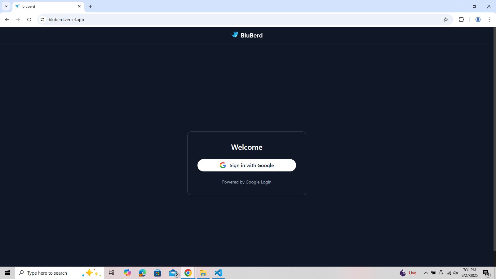 |
| Home | 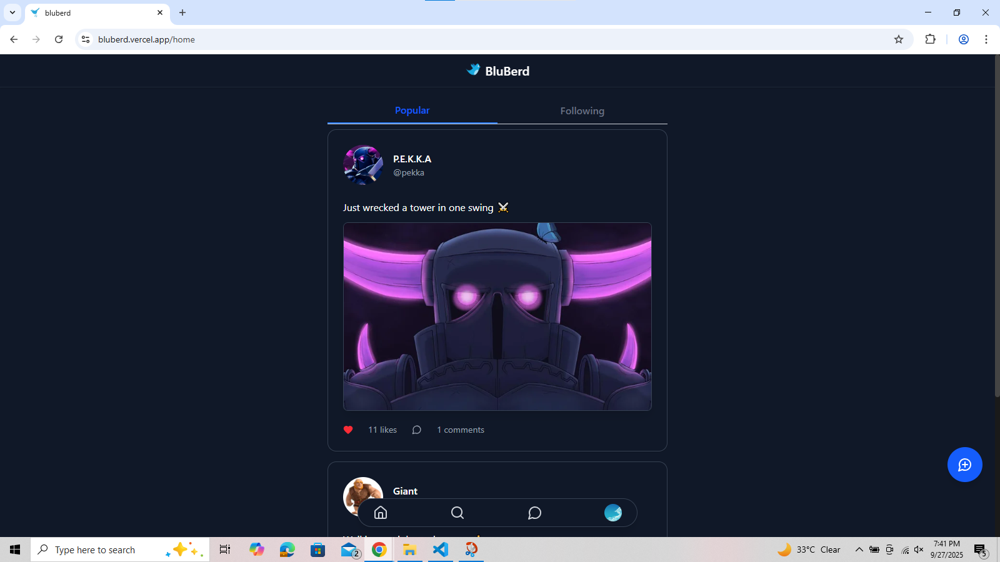 |
| Search User | 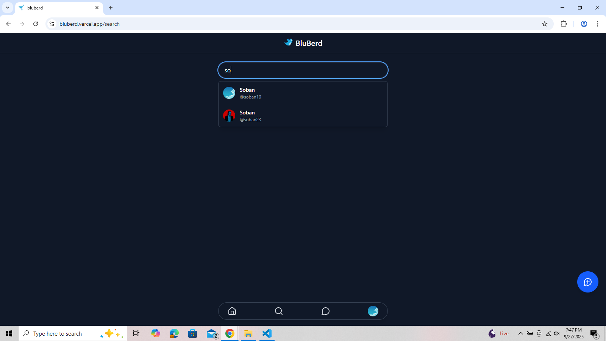 |
| Post | 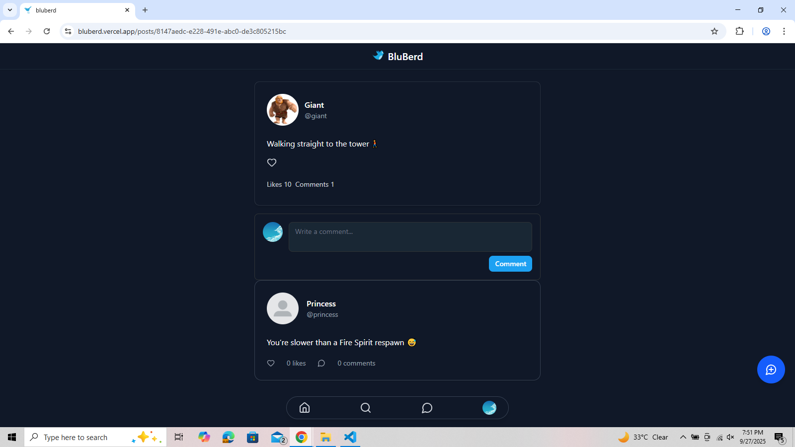 |
| New post | 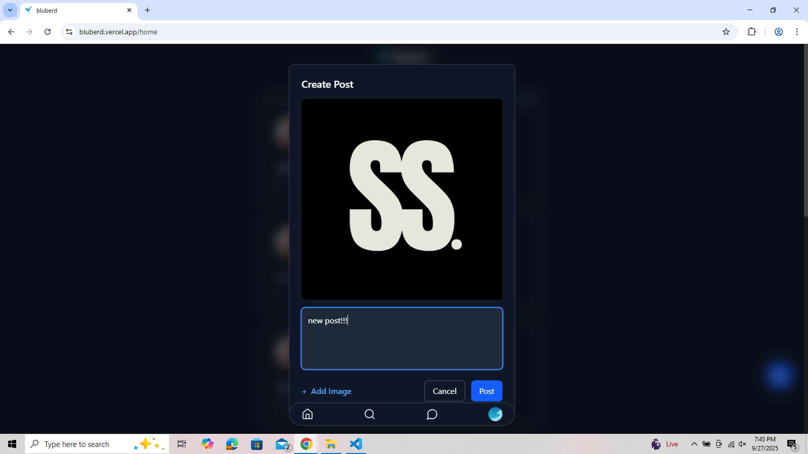 |
| Conversations | 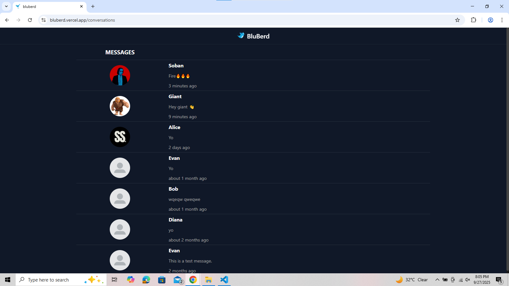 |
| Messages | 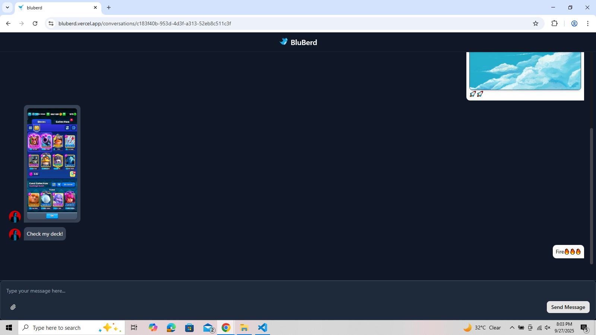 |
| Profile | 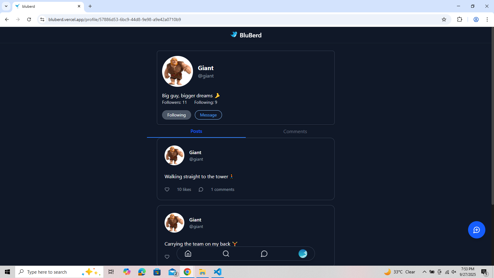 |
| Edit | 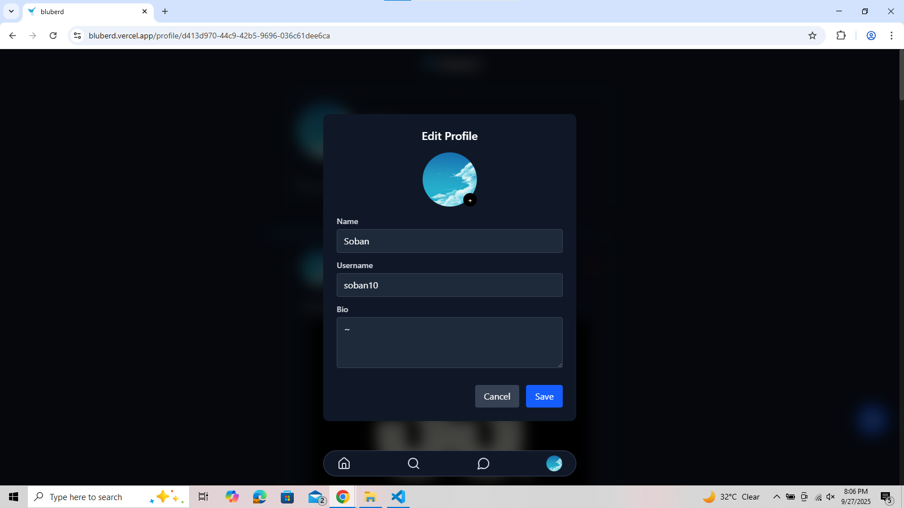 |
| LikesModal | 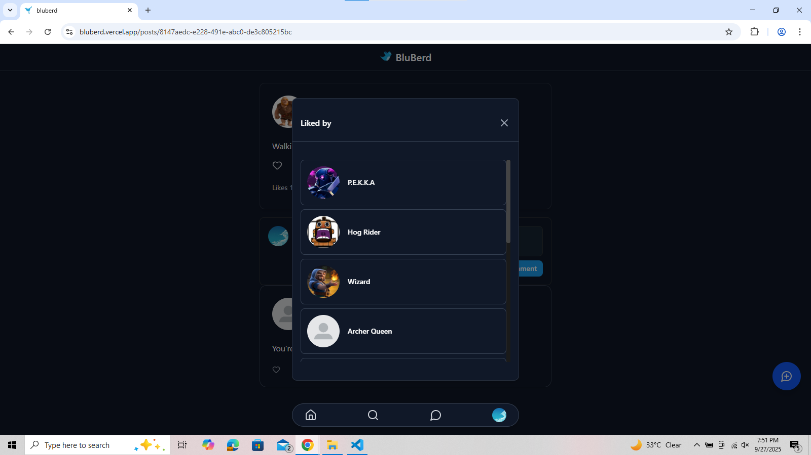 |
| Image | 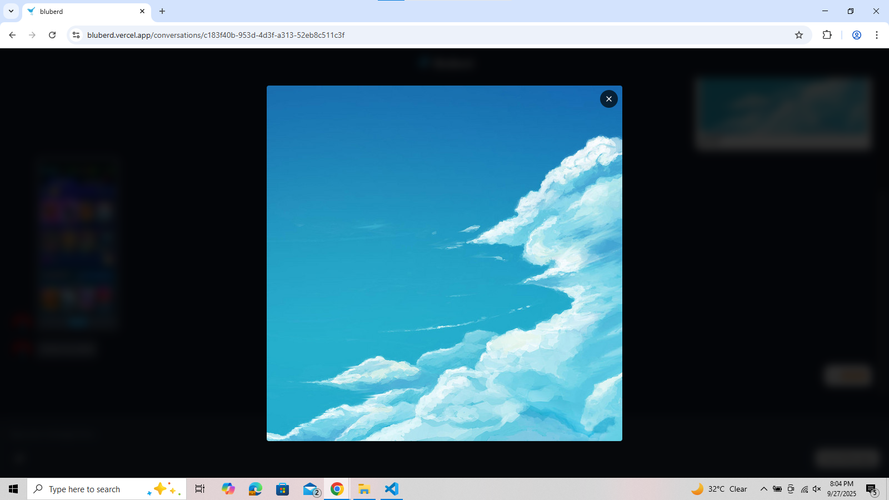 |

—

## 🚀 Tech Stack
-  Frontend: Next.js + React
-  UI Library: shadcn/ui (Radix + Tailwind components)
-  Backend / Database: Supabase (PostgreSQL, Realtime, Storage)
-  Auth: Google OAuth
-  Media: Supabase Storage for image uploads
-  Realtime: Supabase Realtime for chat + feed updates
-  Deployment: Vercel

## 🚀 Features

- Google Authentication
- Create and view posts (with text + image upload)
- Like / Unlike / comment -> posts / comments
- Follow / unfollow users  
- Search users by username
- Realtime chat messaging (Supabase Realtime)
- Paginated messages for smooth infinite scroll in chat  
- Image uploads and preview support (posts & messages)  
- Fully responsive UI with shadcn/ui components

—
  

